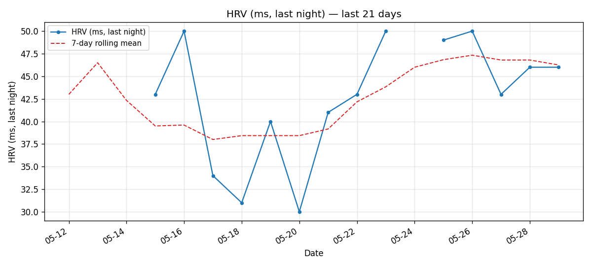

# garmin-sync

> Sync your Garmin Connect **health data** to local JSON files. Designed for
> LLM-driven analysis (Claude Code, Codex, Hermes, ChatGPT, etc.).

[English](./README.md) · [简体中文](./README.zh-CN.md)

`garmin-sync` is a small Python CLI + library that pulls each day's
**health metrics** from your Garmin account and writes them to disk as
structured JSON. There's no daemon, no third-party server, no cloud — just
a script and a folder of files your AI assistant can read.

```bash
pip install garmin-sync          # core (garminconnect under the hood)
pip install 'garmin-sync[plots]' # add matplotlib trend plots
```

## Health-first, not training-first

A deliberate scope choice: **this tool is a health/wellness assistant, not
a training-analysis platform**. We sync the metrics that matter when you're
asking "how am I doing?" — sleep, HRV, stress, Body Battery, resting HR,
SpO2, respiration, daily activity rollup — and we deliberately skip:

- GPS tracks, FIT file ingestion, per-second cadence / power / heart-rate
  streams from activities
- PMC (CTL/ATL/TSB), training load, Training Effect, recovery time
- Workout / training-plan management

`activities` and `training_readiness` are included but **only at the
summary level** (name + duration + distance + calories for activities;
overall score + status for readiness). If you need full training analytics,
[`nrvim/garmin-givemydata`](https://github.com/nrvim/garmin-givemydata) or
[`tcgoetz/GarminDB`](https://github.com/tcgoetz/GarminDB) cover that
territory better.

## What gets synced

One JSON file per day (e.g. `2026-05-28.json`). Top-level keys:

| Key | What it covers |
|---|---|
| 🛏️ `sleep` | Score, start/end, stage breakdown (deep/light/REM/awake/nap), sleep-window SpO2 + HR + respiration + stress |
| 👣 `steps` | Total steps, distance, goal |
| 📊 `hrv` | Weekly avg, last-night avg, 5-min high, balanced baseline + marker, status, feedback phrase |
| 🩸 `spo2` | Daytime SpO2 — avg, min, avg HR during readings |
| 🔋 `body_battery` | Charged, drained, daily max, daily min |
| ❤️ `resting_heart_rate` | RHR + min/max HR when available |
| 🫀 `heart_rate` | Daily HR range (min / max / resting) + 7-day avg RHR |
| 🔥 `calories` | Total / active / BMR (Garmin-computed energy expenditure) |
| ⬆️ `floors` | Floors ascended / descended / daily goal |
| ⏱️ `activity_seconds` | Daily time budget — sleeping / sedentary / active / highly active |
| 💨 `vo2_max` | Running + cycling values (last reported, since updates are sparse) |
| 😰 `stress` | Overall 0–100 + duration in rest / low / medium / high buckets |
| 🫁 `respiration` | Lowest / highest / avg / awake respiration rates |
| 💪 `intensity_minutes` | Moderate + vigorous + weekly goal |
| 🚦 `training_readiness` *(summary only)* | Overall score + per-factor + status |
| 🏃 `activities` *(summary only)* | List of `{name, duration_sec, distance_km, calories}` per activity |

[See the full sample JSON further down.](#sample-output)

## Why this exists

The Garmin Connect app is fine for a quick glance, but you can't ask it
"how has my HRV trended against my sleep score over the last month?" or
"did my Body Battery debt correlate with the headache I had on Thursday?"
— those are LLM-shaped questions, and they need the data on disk in a
format an LLM can chew on.

`garmin-sync` is the boring plumbing. Once a day's JSON is on disk,
everything else (analysis, reports, alerts, plots) is just reading files.

### Comparison with adjacent projects

|   | garmin-sync | [nrvim/garmin-givemydata](https://github.com/nrvim/garmin-givemydata) ⭐108 | [tcgoetz/GarminDB](https://github.com/tcgoetz/GarminDB) ⭐3.1k | [arpanghosh8453/garmin-grafana](https://github.com/arpanghosh8453/garmin-grafana) |
|---|---|---|---|---|
| Scope | **Health-only** (~14 metrics) | **Everything** — 48 SQLite tables incl. FIT files | **Everything** — daily + activities + FIT files | Everything via InfluxDB |
| Storage | One JSON file per day | SQLite + raw FIT copies | SQLite + raw FIT copies | Docker + InfluxDB |
| AI interface | Read JSON files (any tool) | Built-in **MCP server** (45 tools) | Jupyter notebooks | Grafana dashboards |
| Backfill speed | seconds per day | ~30 min for 10 years (first run) | similar to givemydata | similar (Docker setup) |
| Install | `pip install` | `pip install` / `brew tap` | `pip install` / `make` | Docker compose |
| Auth | garminconnect (curl_cffi) | garminconnect (similar) | own garth-based stack | garminconnect |
| License | MIT | AGPL-3.0 | GPL-2.0 | BSD-3 |

**TL;DR**: if you want the **full Garmin firehose with an MCP server**, go
`garmin-givemydata`. If you want **mature SQL tables + Jupyter notebooks**,
go `GarminDB`. If you want **lightweight per-day JSON files an AI assistant
can read directly**, that's this one.

## Quick start

### 1. One-time authorization

```bash
garmin-sync setup --domain garmin.com --email you@example.com
# Prompts for password (or set $GARMIN_PASSWORD); prompts for MFA code if needed
```

Tokens cache under `~/.garminconnect-garmin_com/` (or your profile's
`token_dir`). They auto-refresh while you keep syncing; re-run `setup` if
you change your Garmin password or hit a stale-token error.

> **MFA accounts**: supported natively. The 6-digit code is prompted
> interactively when needed. See
> [`docs/auth-troubleshooting.md`](docs/auth-troubleshooting.md) for
> non-interactive (TOTP) workflows.

### 2. Daily sync

```bash
garmin-sync sync --domain garmin.com --days 1     # yesterday
garmin-sync sync --domain garmin.com --days 30    # backfill 30 days
garmin-sync sync --domain garmin.com --date 2026-05-15
```

JSON files land in `./health/` by default. Override with `--output-dir`.

### 3. (Optional) Profiles

`~/.config/garmin-sync/profiles.toml`:

```toml
[profiles.me]
email      = "you@example.com"
domain     = "garmin.com"
token_dir  = "~/.garminconnect-garmin_com"
output_dir = "~/garmin-data/me"

[profiles.spouse]
email            = "spouse@example.com"
domain           = "garmin.cn"
token_dir        = "~/.garminconnect-spouse-cn"
output_dir       = "~/garmin-data/spouse"
password_env_var = "SPOUSE_GARMIN_PASSWORD"
```

```bash
garmin-sync sync  --profile me --days 1
```

Full details: [`docs/multi-user.md`](docs/multi-user.md).

## Sample output

```json
{
  "date": "2026-05-28",
  "display_name": "Lei",
  "sleep": {
    "score": 88,
    "start": "2026-05-28 00:56",
    "end": "2026-05-28 08:30",
    "stages": {
      "total_min": 450, "deep_min": 114, "light_min": 272, "rem_min": 64,
      "awake_min": 4, "avg_spo2": 93.0, "lowest_spo2": 86,
      "avg_spo2_hr": 60.0, "avg_respiration": 12.0,
      "lowest_respiration": 10.0, "avg_sleep_stress": 10.0
    }
  },
  "steps": {"total": 8833, "distance_km": 7.269, "goal": 7540},
  "hrv": {
    "weekly_avg_ms": 47, "last_night_ms": 46, "status": "BALANCED",
    "last_night_5_min_high_ms": 61,
    "baseline": {"balanced_low": 39, "balanced_upper": 51, "marker_value": 0.58},
    "feedback_phrase": "HRV_BALANCED_6"
  },
  "spo2":              {"avg_pct": 93.0, "min_pct": 86, "avg_hr_bpm": 60.0},
  "body_battery":      {"charged": 86, "drained": 92, "max": 99, "min": 7},
  "resting_heart_rate":{"value": 56.0},
  "heart_rate":        {"min": 54, "max": 130, "resting": 56, "last_7d_avg_resting": 56},
  "calories":          {"total_kcal": 2556, "active_kcal": 537, "bmr_kcal": 2019},
  "floors":            {"ascended": 0.0, "descended": 6.45, "goal": 10},
  "activity_seconds":  {"highly_active_sec": 977, "active_sec": 8202, "sedentary_sec": 49981, "sleeping_sec": 27240},
  "vo2_max":           {"running": 43.0, "running_precise": 42.5},
  "stress":            {"overall": 43, "level": "中", "rest_min": 494, "low_min": 189, "medium_min": 259, "high_min": 288},
  "respiration":       {"low": 9.0, "high": 22.0},
  "intensity_minutes": {"moderate_min": 3, "vigorous_min": 0, "weekly_goal_min": 150}
}
```

## API budget

A single `sync` of one day makes **13–14 HTTP requests** (14 if VO2 Max
isn't reported for that day — the fetcher widens to a 1-year range). For a
daily cron job this is comfortably inside Garmin's per-account limits;
backfilling `--days 365` once is also fine. Tight loops (e.g. `--days 1`
in a busy loop) will eventually trip rate limiting.

## CSV export

```bash
garmin-sync export-csv --profile me --start 2026-05-01 --end 2026-05-29 \
    --out ~/garmin-may.csv
```

Flattens the daily JSON into one row per day with a stable column schema.
Missing values are blank (not `0`), so spreadsheets can tell "no data"
from "value was zero". See [`docs/csv-and-plots.md`](docs/csv-and-plots.md).

## Trend plots



*Generated by `garmin-sync plot --metric hrv --days 21`. Blue = nightly HRV,
red dashed = 7-day rolling mean. The gaps on the left are real — some
nights the watch didn't capture an HRV reading, and the plotter draws a
break instead of inventing values. Sample data: May 2026.*

```bash
pip install 'garmin-sync[plots]'
garmin-sync plot --profile me --metric hrv --days 30 --out hrv.png
garmin-sync plot --profile me --metric sleep_score --days 90 --out sleep.png
```

Single-metric line chart + 7-day rolling mean. Headless-safe (Agg backend).
Supported metrics: `hrv`, `hrv_5min_high`, `sleep_score`, `sleep_total_min`,
`steps`, `body_battery_min`, `body_battery_max`, `stress_overall`, `rhr`,
`vo2_max_running`.

## Crontab example

```cron
30 6 * * * GARMIN_PASSWORD='...' /usr/local/bin/garmin-sync sync --profile me --days 1 >> /var/log/garmin-sync.log 2>&1
```

## Use as a library

```python
from garmin_sync.auth import authenticate
from garmin_sync.collect import collect_day
from garmin_sync.profile import load_profile
from garmin_sync.storage import write_day_json

profile = load_profile("me")
client = authenticate(profile)
data = collect_day(client, "2026-05-28")
write_day_json(data, profile.output_dir)
```

## FAQ

**Does it work with `garmin.cn` (China region) accounts?**
Sleep, steps, HRV, SpO2, stress, intensity minutes, daily summary, and
activities are confirmed working. Body Battery, Resting HR, VO2 Max,
Training Readiness, and Respiration are **almost certainly 404** on
`garmin.cn` (based on community reports + path-prefix inference — we
haven't tested directly on a `.cn` account). If you have a CN account and
need those, you'll need Garmin support to migrate the account region.

**Does it handle MFA?**
Yes. `setup` prompts for the 6-digit code interactively. Token persistence
means one prompt per setup, not per `sync`.

**Where do tokens / passwords go?**
Tokens: plaintext JSON in `token_dir` (default `~/.garminconnect-<domain>/`).
Passwords: only read from env vars (or `~/.hermes/.env` if present);
nothing is ever written back.

**Will it get rate-limited?**
One `sync --days N` = ~13×N HTTP requests. Daily cron is fine. Burst
backfilling 1–2 years works. Looping `sync --days 1` in a busy loop will
eventually 429 you.

## Status

Pre-1.0. The JSON schema is "stable enough that I use it daily" but I may
add fields. Removing or renaming an existing field requires a minor
version bump.

## License

[MIT](LICENSE)
