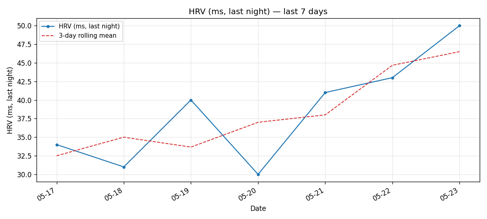
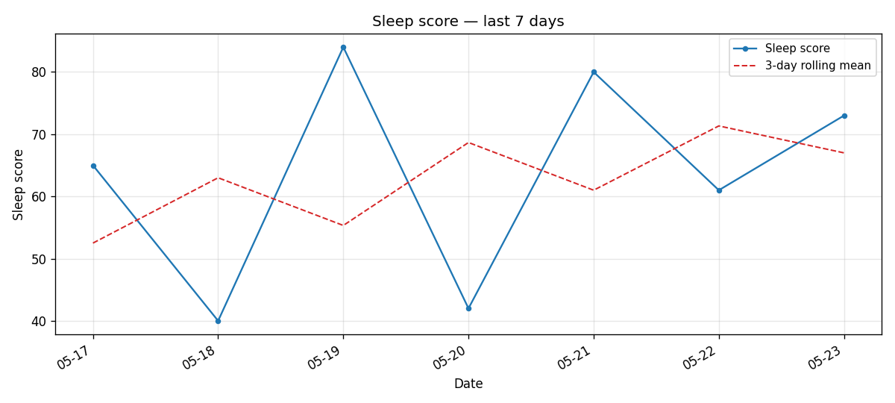

# garmin-sync

> 一个**给 AI Agent 用的佳明 skill** —— 把 Garmin Connect 的健康数据同
> 步成本地 JSON，让 Claude Code / Codex / Hermes / ChatGPT 帮你回答每天
> 那句"我今天状态怎么样？"。
>
> *原生支持 `garmin.com`（国际）+ `garmin.cn`（国内）双站。*

[English](./README.md) | **简体中文**

[](https://skills.sh/denki-san/garmin-sync)

`garmin-sync` 是一个极简的 Python CLI + 库，把佳明账号每日**健康指标**
拉到本地、写成结构化 JSON 文件。没有 daemon，没有第三方服务器，没有云
端——只有一个脚本和一个数据目录，AI 助手可以直接读。

```bash
# 作为 Agent Skill 安装（Claude Code / Codex / Cursor 等）
npx skills add denki-san/garmin-sync

# 或者直接当 Python 包
pip install garmin-sync          # 核心（底层用 garminconnect）
pip install 'garmin-sync[plots]' # 加上 matplotlib 趋势图
```

<table>
<tr>
<td width="50%" align="center">
  <a href="docs/screenshots/hero-hrv.png"></a>
  <br/><sub><b>HRV（每晚）</b></sub>
</td>
<td width="50%" align="center">
  <a href="docs/screenshots/hero-sleep-score.png"></a>
  <br/><sub><b>睡眠得分</b></sub>
</td>
</tr>
</table>

<sub><i>样图：维护者本人账号的 7 天数据（2026-05-17 → 23）。每张由 <code>garmin-sync plot --metric &lt;name&gt; --days 7 --rolling 3</code> 生成。</i></sub>

## 定位是佳明 skill，不是全量归档工具

`garmin-sync` 设计成**给 AI agent 装一次就能用的 skill**，每天早上给你
一份结构化的身体状态快照。设计取舍都从这一点出发：

- **Skill-shaped**：自带 `SKILL.md`，任何 agent 装上就知道怎么用
- **Agent-first I/O**：一天一个 JSON 文件，无 DB、无 schema 迁移，任何 LLM 直接 `cat` 就能读
- **每天追踪，不做全量归档**：每天 ~13 个请求，cron 跑几秒就完
- **健康优先**：睡眠 / HRV / 压力 / Body Battery / 静息心率——回答"今天状态如何"的那些指标
- **训练数据：规划中，不承诺时间表**：以后按需逐步补活动 / 训练字段；欢迎 PR

**有意跳过**的部分：

- GPS 轨迹、FIT 文件、活动里的每秒 cadence/功率/心率时序
- PMC（CTL/ATL/TSB）、训练负荷、Training Effect、Recovery Time
- Workout / 训练计划管理

`activities` 和 `training_readiness` 是收的，**但只到摘要级**（activities
只有 name + 时长 + 距离 + 卡路里；readiness 只有总分 + status）。如果你
想要完整训练分析，[`nrvim/garmin-givemydata`](https://github.com/nrvim/garmin-givemydata)
或 [`tcgoetz/GarminDB`](https://github.com/tcgoetz/GarminDB) 更合适。

## 抓了哪些数据

每天一个 JSON 文件（例如 `2026-05-28.json`），顶层 key：

| Key | 含义 |
|---|---|
| 🛏️ `sleep` | 睡眠得分、入睡/起床时间、stages（深/浅/REM/清醒/午睡）、睡眠期间 SpO2 + 心率 + 呼吸率 + 压力 |
| 👣 `steps` | 总步数、距离、目标 |
| 📊 `hrv` | 周平均、昨晚平均、5min 高值、balanced baseline + marker、状态、feedback 短语 |
| 🩸 `spo2` | 白天血氧 — 平均、最低、读数时的平均心率 |
| 🔋 `body_battery` | 充电、消耗、当日最高、当日最低 |
| ❤️ `resting_heart_rate` | 静息心率（可能含 min/max HR） |
| 🫀 `heart_rate` | 全天心率范围（min / max / resting）+ 7 日平均 RHR |
| 🔥 `calories` | 总 / 活动 / 基础代谢（佳明算出的能量消耗） |
| ⬆️ `floors` | 上行楼层 / 下行楼层 / 日目标 |
| ⏱️ `activity_seconds` | 每日时间分配 — 睡眠 / 久坐 / 活动 / 高强度活动 秒数 |
| 💨 `vo2_max` | 跑步 + 骑行 VO2 Max（最近一次报告值，因为更新很稀疏） |
| 😰 `stress` | 综合压力 0–100 + 放松/低/中/高 各档时长 |
| 🫁 `respiration` | 最低 / 最高 / 平均 / 清醒时呼吸率 |
| 💪 `intensity_minutes` | 中等 + 高强度 + 周目标 |
| 🚦 `training_readiness` *（仅摘要）* | 总分 + 各因子 + status |
| 🏃 `activities` *（仅摘要）* | 当日活动列表，每条 `{name, duration_sec, distance_km, calories}` |

[完整 JSON 样本见下方。](#sample-output)

## 前提：数据必须先在 Garmin Connect 上

> [!IMPORTANT]
> `garmin-sync` 读的是佳明**云端**，不是你的手表。如果当天手表没同步到
> 手机 App、App 没推到云端，那一天的 JSON 就是空的或字段不全。

`garmin-sync` 是从佳明的 web API 拉数据的，**不会**直接读你的手表。数据
链路是：

```
手表  →  手机上的 Garmin Connect App  →  Garmin Connect 云端  →  garmin-sync  →  你的磁盘
```

如果你的手表当天没同步到手机 App（或 App 没推到云端），那一天的 JSON 就
是空的或字段不全。跑 `garmin-sync` 之前手动强制一次同步：

1. 打开手机上的 **Garmin Connect** App
2. 让手表在蓝牙范围内，首页**下拉刷新**
3. 等"上次同步"时间戳更新

这也是为什么凌晨刚过几分钟跑 `garmin-sync sync --days 1` 经常拉回半空
数据——那时手表还没靠近手机。

## 为什么做这个

佳明 app 看每日数据还行，但你没法问它"我最近一个月的 HRV 趋势和睡眠分
对应得怎么样？"或者"周四头痛那天我 Body Battery 债务是不是特别重？"——
这些问题适合 LLM 来答，需要数据是 LLM 能消费的格式落在本地。

`garmin-sync` 就是那段管道。一旦某天的 JSON 落到磁盘上，后面所有事
（分析、日报、告警、画图）都只是读文件而已。

### 不是你要的？

如果你的目标是**归档 + 回溯分析**，而不是每天给 agent 用的轻量追踪，
下面这几个更合适：

- **佳明全量数据 + 自带 MCP server** → [`nrvim/garmin-givemydata`](https://github.com/nrvim/garmin-givemydata)
- **成熟的 SQL 表 + Jupyter notebook，适合活动/FIT 分析** → [`tcgoetz/GarminDB`](https://github.com/tcgoetz/GarminDB)
- **SQLite + 完整 schema 文档，专门设计成 AI 数据源** → [`diegoscarabelli/garmin-health-data`](https://github.com/diegoscarabelli/garmin-health-data)

完整逐项对比见下表。

### 和相邻项目对比

|   | garmin-sync | [nrvim/garmin-givemydata](https://github.com/nrvim/garmin-givemydata) ⭐108 | [tcgoetz/GarminDB](https://github.com/tcgoetz/GarminDB) ⭐3.1k | [diegoscarabelli/garmin-health-data](https://github.com/diegoscarabelli/garmin-health-data) ⭐61 |
|---|---|---|---|---|
| 抓取范围 | **只健康** (~14 个 metric) | **全量** — 48 张 SQLite 表 + FIT 文件 | **全量** — daily + activities + FIT | **全量** — 健康 + 活动 (FIT/TCX) + 训练 |
| 存储 | 一天一 JSON 文件 | SQLite + 原始 FIT | SQLite + 原始 FIT | SQLite + 原始文件（4 文件夹生命周期） |
| AI 接入 | 读 JSON 文件（任何工具） | 内置 **MCP server**（45 个 tool） | Jupyter notebooks | 读 SQLite（schema 有完整文档） |
| 回填速度 | 每天几秒 | 首次 ~30 min for 10 年 | 类似 givemydata | 可中断续传，一遍跑完 |
| 安装 | `pip install` | `pip install` / `brew tap` | `pip install` / `make` | `pip install` |
| 认证 | garminconnect (curl_cffi) | garminconnect（类似） | 自己 fork garth | **自带** SSO 客户端 |
| 区服 | 国际 + **国内** (`garmin.cn`) | 仅国际 | 仅国际 | 仅国际 |
| 协议 | MIT | AGPL-3.0 | GPL-2.0 | Apache-2.0 |

**一句话**：想要**佳明全量数据 + MCP server**，去 `garmin-givemydata`；
想要**成熟的 SQL 表 + Jupyter notebook**，去 `GarminDB`；想要**轻量
per-day JSON 文件、AI 助手能直接读**，就用这个。

## 快速上手

> 这一段是写给 AI agent 照着做的——把这个仓库 URL 丢给你的 AI 助手，
> 它能从头到尾把 garmin-sync 装好。人类读者也可以直接照同样步骤跑。

### Step 1 — 放置 skill 文件

检测当前机器上哪些 AI agent 的 skill 目录已存在：

| 路径 | Agent |
|---|---|
| `~/.claude` | Claude Code |
| `~/.openclaw` | OpenClaw |
| `~/.hermes` | Hermes |
| `~/.config/opencode` | OpenCode |

对每个检测到的目录 `$AGENT_DIR`，clone 本仓库到它的 `skills/` 子目录：

```bash
mkdir -p "$AGENT_DIR/skills"
git clone https://github.com/denki-san/garmin-sync \
  "$AGENT_DIR/skills/garmin-sync"
```

如果 `$AGENT_DIR/skills/garmin-sync` 已存在，改用
`git -C "$AGENT_DIR/skills/garmin-sync" pull --ff-only` 拉新版。

如果四个目录都不存在，问用户要把这个 skill 装给哪个 AI 工具用，然后建
那个目录作为唯一目标。

### Step 2 — 安装 Python 包

```bash
pip install git+https://github.com/denki-san/garmin-sync
# 想要趋势图功能，多装一个 extra：
pip install 'git+https://github.com/denki-san/garmin-sync#egg=garmin-sync[plots]'
```

这一步把 `garmin-sync` CLI 装到 `$PATH`。同一台机器上所有 AI agent
共享同一个 CLI——装一次就够。要求 Python 3.10 或以上。

### Step 3 — 配置 profile

向用户询问：

- 佳明账号邮箱
- 区域（`garmin.com` 国际版 / `garmin.cn` 国区版）
- JSON 文件落盘目录（默认 `~/.local/share/garmin-sync`）

写入 `~/.config/garmin-sync/profiles.toml`：

```toml
[profiles.me]
email      = "you@example.com"
domain     = "garmin.com"
token_dir  = "~/.garminconnect-garmin_com"
output_dir = "~/.local/share/garmin-sync"
```

多用户配置（家人、伴侣等）见 [`docs/multi-user.md`](docs/multi-user.md)。

### Step 4 — 一次性 SSO 授权

向用户要 Garmin 密码（导出为 `$GARMIN_PASSWORD` 环境变量，或写到
profile 的 `password_env_var`），然后跑：

```bash
garmin-sync setup --profile me
```

如果佳明要求 MFA，CLI 会交互式 prompt 6 位验证码——把 prompt 转给用户
填。Token 缓存在 `token_dir`，同步期间会自动刷新；只有改密码或者出现
token 失效错误时才需要重新跑 `setup`。

非交互场景（cron / TOTP）见
[`docs/auth-troubleshooting.md`](docs/auth-troubleshooting.md)。

### Step 5 — 跑一次同步

```bash
garmin-sync sync --profile me --days 1     # 昨天
garmin-sync sync --profile me --days 30    # 回填 30 天
```

验证文件已落盘：

```bash
test -f "$(dirname "$(garmin-sync sync --profile me --days 1 2>&1 | grep -oE '/.*\.json' | head -1)")/$(date -v-1d +%Y-%m-%d).json" \
  && echo OK
# Linux：把 `date -v-1d` 换成 `date -d yesterday`
```

如果输出 JSON 缺用户期望的字段（Body Battery、HRV 等），可能是手表当天
还没把数据推到佳明云端——见上方[前提说明](#前提数据必须先在-garmin-connect-上)。

### Step 6 — （可选）定时同步

`garmin-sync` 是**按需运行**的——装上不会自动起 daemon 也不会自动注册
cron。要每天自动跑就加一条 cron：

```cron
30 6 * * * GARMIN_PASSWORD='...' /usr/local/bin/garmin-sync sync --profile me --days 1 >> /var/log/garmin-sync.log 2>&1
```

或者用 agent 自带的调度器（Hermes cron、macOS launchd、Linux systemd
timer 等）。

> [!IMPORTANT]
> **定时任务跑之前，先打开手机 Garmin Connect App 下拉刷新。**
> `garmin-sync` 读的是佳明云端，手表当天的数据如果还没推上去，sync 拉
> 回来就是半空的 JSON。最省心：手机晚上放手表旁边，早上系统会自动推
> 一次。

## Sample output

```json
{
  "date": "2026-05-28",
  "display_name": "Lei",
  "sleep": {
    "score": 88,
    "start": "2026-05-28 00:56",
    "end": "2026-05-28 08:30",
    "stages": {
      "total_min": 450, "deep_min": 114, "light_min": 272, "rem_min": 64,
      "awake_min": 4, "avg_spo2": 93.0, "lowest_spo2": 86,
      "avg_spo2_hr": 60.0, "avg_respiration": 12.0,
      "lowest_respiration": 10.0, "avg_sleep_stress": 10.0
    }
  },
  "steps": {"total": 8833, "distance_km": 7.269, "goal": 7540},
  "hrv": {
    "weekly_avg_ms": 47, "last_night_ms": 46, "status": "BALANCED",
    "last_night_5_min_high_ms": 61,
    "baseline": {"balanced_low": 39, "balanced_upper": 51, "marker_value": 0.58},
    "feedback_phrase": "HRV_BALANCED_6"
  },
  "spo2":              {"avg_pct": 93.0, "min_pct": 86, "avg_hr_bpm": 60.0},
  "body_battery":      {"charged": 86, "drained": 92, "max": 99, "min": 7},
  "resting_heart_rate":{"value": 56.0},
  "heart_rate":        {"min": 54, "max": 130, "resting": 56, "last_7d_avg_resting": 56},
  "calories":          {"total_kcal": 2556, "active_kcal": 537, "bmr_kcal": 2019},
  "floors":            {"ascended": 0.0, "descended": 6.45, "goal": 10},
  "activity_seconds":  {"highly_active_sec": 977, "active_sec": 8202, "sedentary_sec": 49981, "sleeping_sec": 27240},
  "vo2_max":           {"running": 43.0, "running_precise": 42.5},
  "stress":            {"overall": 43, "level": "中", "rest_min": 494, "low_min": 189, "medium_min": 259, "high_min": 288},
  "respiration":       {"low": 9.0, "high": 22.0},
  "intensity_minutes": {"moderate_min": 3, "vigorous_min": 0, "weekly_goal_min": 150}
}
```

## API 用量

`sync` 一天打 **13–14 个 HTTP 请求**（VO2 Max 当天空数据时会触发 1 次
回退到 1 年范围查询，多 1 次）。每天一次 cron 远远在 Garmin 单账号限流
之内；一次性回填 `--days 365` 也没问题。循环 `sync --days 1` 一直跑
迟早会触发 429。

## CSV 导出

```bash
garmin-sync export-csv --profile me --start 2026-05-01 --end 2026-05-29 --out ~/garmin-may.csv
```

每日 JSON 扁平化成 CSV。列顺序**固定**，新指标在末尾追加，老表格不会被
打乱。

<details>
<summary>完整表头（44 列）</summary>

```
date, sleep_score, sleep_total_min, sleep_deep_min, sleep_light_min, sleep_rem_min,
sleep_awake_min, sleep_avg_spo2, sleep_lowest_spo2, sleep_avg_respiration,
sleep_avg_stress, steps_total, steps_distance_km, steps_goal, hrv_weekly_avg_ms,
hrv_last_night_ms, hrv_status, hrv_5min_high_ms, hrv_baseline_low,
hrv_baseline_upper, spo2_avg_pct, spo2_min_pct, spo2_avg_hr_bpm,
body_battery_charged, body_battery_drained, body_battery_max, body_battery_min,
stress_overall, stress_level, stress_rest_min, stress_low_min, stress_medium_min,
stress_high_min, respiration_low, respiration_high, respiration_avg,
intensity_moderate_min, intensity_vigorous_min, intensity_weekly_goal_min,
training_readiness_score, training_readiness_status, resting_heart_rate,
vo2_max_running, vo2_max_cycling, activities_count
```

</details>

> [!IMPORTANT]
> 缺失值用**空字符串**而不是 `0` 或 `NaN`——下游工具能区分"没数据"和"值是 0"。

## 趋势图

README 顶部那 2 张样图就是 `plot` 子命令出的：

```bash
pip install 'garmin-sync[plots]'
garmin-sync plot --profile me --metric hrv --days 30 --out hrv.png
```

单指标线图 + 7 天滑动均值。缺失日断线不补 0。headless 安全（Agg 后端）。
支持的 metric 跑 `garmin-sync plot --list-metrics` 查。

## FAQ

**`garmin.cn` 国区账号能用吗？**

> [!WARNING]
> 睡眠、步数、HRV、SpO2、压力、运动强度、daily summary、活动这些**已确认
> 能用**。Body Battery、静息心率、VO2 Max、训练准备度、Respiration **几
> 乎肯定 404**（基于社区报告 + 路径前缀推论；我没在 `.cn` 账号上直接验
> 证过）。如果国区账号又想要这几个数据，需要联系佳明客服把账号迁到国际
> 版。

**会自动定时同步吗？**
不会。`garmin-sync` 只在你（或者你的 AI agent 通过 skill）调用时才跑。
要每天自动跑得自己排班——见[快速上手](#快速上手)。

**支持两步验证吗？**
支持。`setup` 在 Garmin 要求时会交互式 prompt 你输 6 位 MFA。token 持
久化意味着一次 setup 输一次 MFA，之后 cron 跑 `sync` 都不用再输。

**token 和密码存哪？**
Token 以明文 JSON 存在 `token_dir`（默认 `~/.garminconnect-<domain>/`）。
密码只从环境变量读（或者 `~/.hermes/.env`，存在的话），从不回写到磁盘。

**会被佳明限流吗？**
`sync --days N` 大约 13×N 个 HTTP 请求。每天 cron 一次没问题；一次性回
填 1-2 年也行；循环 `sync --days 1` 一直跑迟早 429。

## 状态

Pre-1.0。JSON schema "已经稳定到我自己每天用"的程度，但可能会加字段。
删字段或改字段名需要 minor 版本号 bump。

## License

[MIT](LICENSE)
